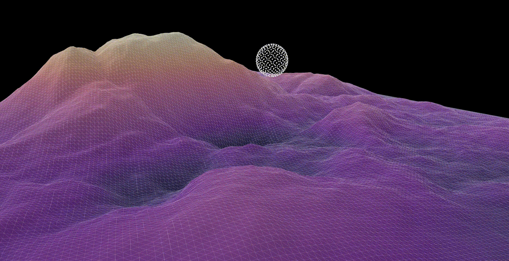

# Axion: A Differentiable Physics Simulator

**Axion** is a high-performance, differentiable physics simulator designed for robotics research, machine learning, and applications requiring accurate gradients through complex dynamics.

    

## Overview

Differentiable simulators are crucial tools for bridging physics-based modeling with gradient-based optimization techniques common in machine learning and robotics. Axion aims to provide a powerful and flexible simulation environment that addresses key challenges in the field, focusing on:

* **Performance:** Leveraging GPU acceleration for real-time or faster-than-real-time simulation speeds suitable for control and reinforcement learning.
* **Accuracy:** Implementing physically principled models, particularly for contact dynamics, to ensure high fidelity for tasks like system identification and interaction learning.
* **Robust Gradients:** Employing novel techniques to improve the quality and reliability of gradients propagated through the simulation, especially around non-smooth events like contact and impacts.

## Key Features

* **Differentiable Physics:** Computes gradients of simulation outcomes with respect to system parameters and control inputs, enabling integration with gradient-based optimization and learning frameworks.
* **GPU Acceleration:** Designed from the ground up for parallel execution on modern GPUs, maximizing computational throughput.
* **Adaptive Time Stepping:** Implements a novel adaptive scheme that dynamically blends implicit (stable) and explicit (fast) integration methods. This aims to optimize performance while ensuring stability and improving gradient quality, particularly around discontinuities.
* **Accurate Contact Modeling:** (Initially focuses on/Includes) methods like Non-Smooth Newton to handle contact and friction with higher physical fidelity compared to common approximations.
* **(Future Goal) Soft Body Support:** Architected with future extensions to soft body dynamics in mind (e.g., for wheels, terrain).
* **(Current Focus) Rigid Body Dynamics:** Provides robust simulation of articulated and unarticulated rigid body systems.
