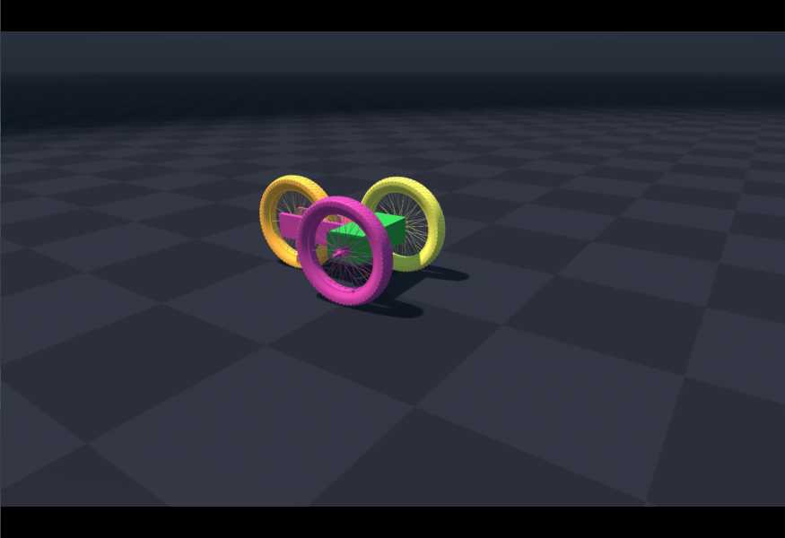
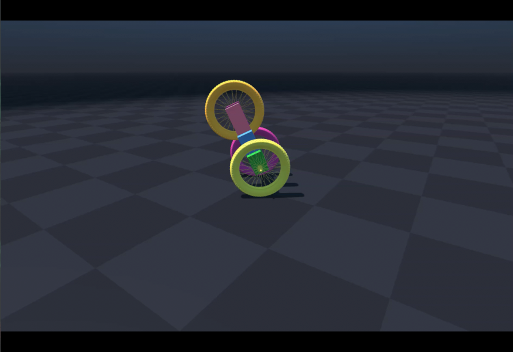
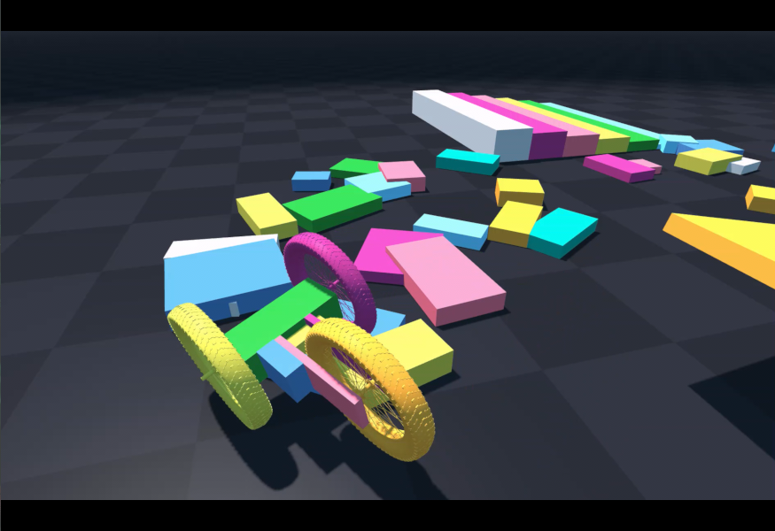
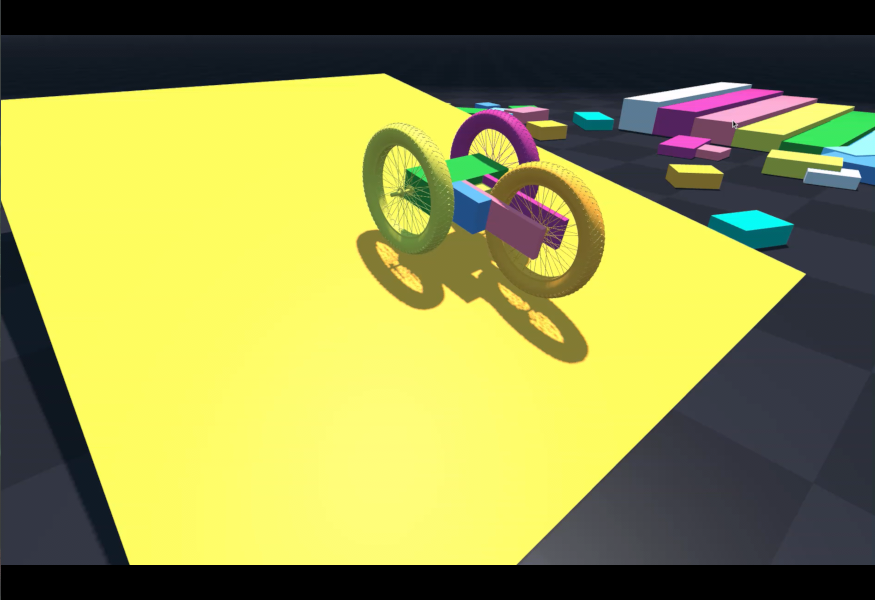
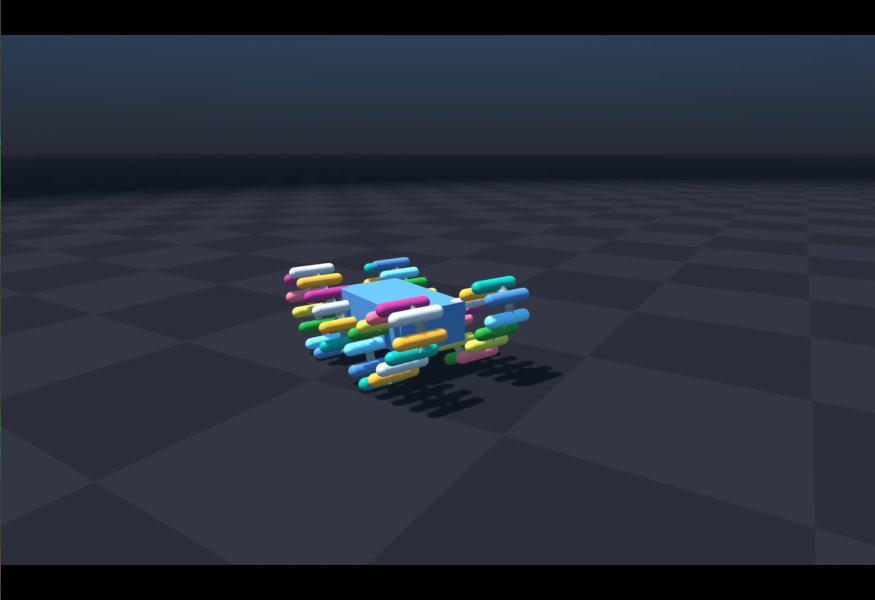
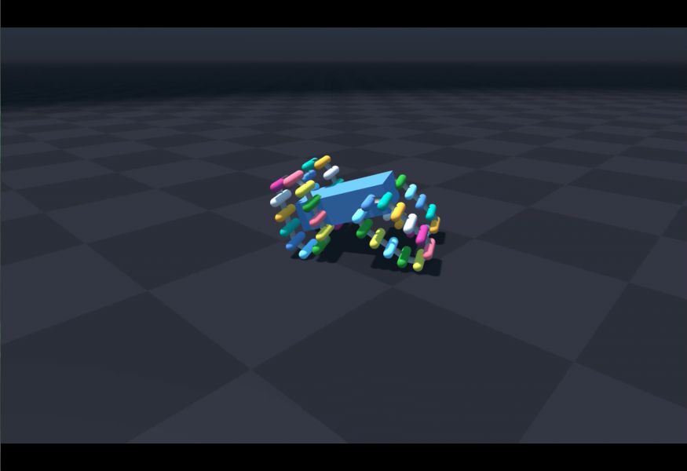
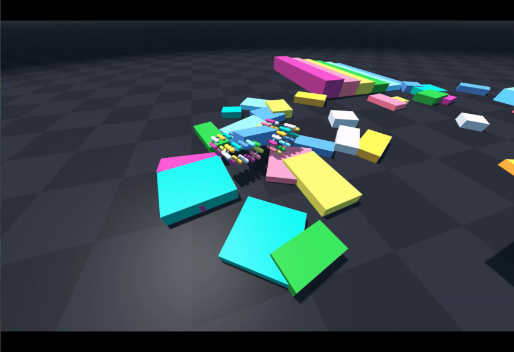
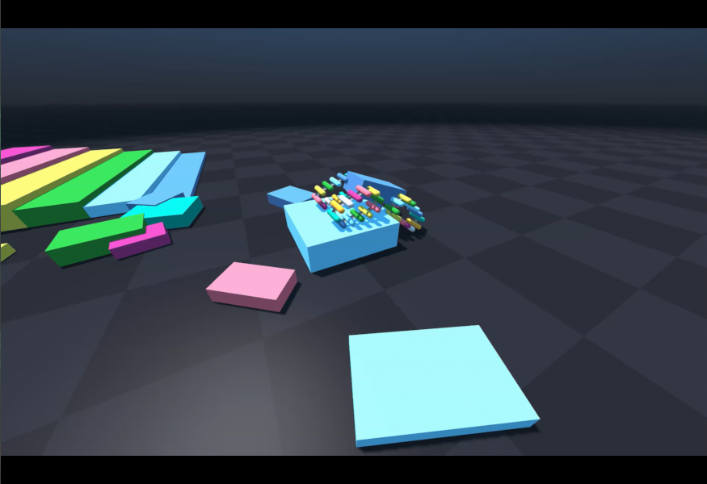

<div align="center">
    <h1>Axion</h1>
    <p>A GPU-accelerated physics simulator with non-smooth contact and exact friction</p>
</div>

---

Axion is a rigid body simulator built for robotics research where contact accuracy matters. Unlike simulators that smooth or approximate the friction cone, Axion solves the **non-penetration contact constraints exactly** and handles **non-smooth friction** — making it particularly well-suited for skid-steer locomotion, flipper robots, and any scenario where slip behavior drives the dynamics.

Key properties:

- **Stable at large timesteps** — 5×10⁻² s works well in most scenes; some contact-heavy scenes remain stable at 1×10⁻¹ s
- **Parallel worlds** — run thousands of independent simulations simultaneously on a single GPU
- **Maximal coordinates** — makes it straightforward to model unconventional robot morphologies accurately
- **CUDA-accelerated** — built on [NVIDIA Warp](https://github.com/NVIDIA/warp) and [Newton](https://github.com/newton-physics/newton)

---

## Helhest — 3-Wheeled Skid-Steer Robot

Helhest is a three-wheeled skid-steer robot that can also flip itself upright. Accurate friction is critical here: skid-steer turning depends entirely on the difference in lateral friction forces between wheels, and the flip maneuver requires correct contact dynamics throughout.

<table>
  <tr>
    <td align="center">
      <a href="https://github.com/user-attachments/assets/dd1f1bc5-c91b-4d57-999b-4fda29c69596">
        
      </a>
      <br><b>Skid-steer turning</b>
    </td>
    <td align="center">
      <a href="https://github.com/user-attachments/assets/53e5079e-fe8d-4476-a2ec-e027f61fe2a6">
        
      </a>
      <br><b>Self-righting flip</b>
    </td>
  </tr>
  <tr>
    <td align="center">
      <a href="https://github.com/user-attachments/assets/363bcfca-ea37-4adb-8e50-8ff673c296e6">
        
      </a>
      <br><b>Dense obstacle field</b>
    </td>
    <td align="center">
      <a href="https://github.com/user-attachments/assets/3fb658a2-933c-46d7-9c4f-bd35bef470a6">
        
      </a>
      <br><b>Motor realism on incline</b> — P-velocity controller drifts under load as expected
    </td>
  </tr>
</table>

---

## Marv — Flipper Tracked Robot

Marv is a tracked robot with four articulated flippers — each flipper carries its own track. The combination of track contacts, flipper joints, and varying terrain makes this a demanding test for any simulator. Maximal coordinates make the morphology easy to express without hacks.

<table>
  <tr>
    <td align="center">
      <a href="https://github.com/user-attachments/assets/873f6c1c-9e41-4aed-a379-b4f9a37be361">
        
      </a>
      <br><b>Skid-steer turning</b>
    </td>
    <td align="center">
      <a href="https://github.com/user-attachments/assets/10f61094-0d38-4aee-97e8-01e133aa5c21">
        
      </a>
      <br><b>Flipper articulation</b>
    </td>
  </tr>
  <tr>
    <td align="center">
      <a href="https://github.com/user-attachments/assets/bc3e81c9-e839-44f7-aa6a-4796e2ed4b31">
        
      </a>
      <br><b>Dense obstacle field</b>
    </td>
    <td align="center">
      <a href="https://github.com/user-attachments/assets/386a8857-a66a-4715-bb1e-2572b9cfc598">
        
      </a>
      <br><b>Large obstacle traversal</b>
    </td>
  </tr>
</table>

---

## Installation

### Prerequisites

- **Python** 3.12+
- **CMake** 3.x — must be below 4.0 (`openmesh` does not build with CMake 4.x)
- **CUDA** 12+ with an NVIDIA GPU (strongly recommended)

If your system CMake is 4.x, install CMake 3.27 manually:

```bash
mkdir -p ~/.local/opt
wget https://github.com/Kitware/CMake/releases/download/v3.27.0/cmake-3.27.0-linux-x86_64.tar.gz -P /tmp
tar -xzf /tmp/cmake-3.27.0-linux-x86_64.tar.gz -C ~/.local/opt
```

### Setup

```bash
# Clone and enter the repo
git clone https://github.com/aleskucera/axion.git
cd axion

# Pull the newton submodule
git submodule update --init --recursive

# Install (CMake 3.x as default)
uv sync --extra sim

# Or, if your system CMake is 4.x
PATH=~/.local/opt/cmake-3.27.0-linux-x86_64/bin:$PATH uv sync --extra sim
```

All dependencies are pinned to exact versions for reproducibility. `uv` handles the virtual environment automatically.

---

## Contact

**Aleš Kučera** — [kuceral4@fel.cvut.cz](mailto:kuceral4@fel.cvut.cz)
Czech Technical University in Prague
